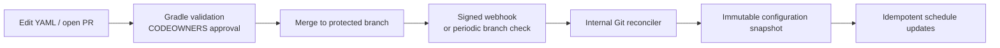

# Heimdall — Monorepo Implementation Plan

## 1. Product scope and repository organization

Build a headless synthetic monitoring platform with Git-managed configuration and API-driven execution, integrations, and results. All platform source code, deployment definitions, central configuration, and team test configuration live in one monorepo.

GitHub PRs are the only authoring and approval path for persistent configuration. The platform automatically reconciles approved changes; it does not expose configuration-authoring APIs. PostgreSQL stores historical results for the first release, with object storage for large artifacts.

The first production release supports API synthetics. Browser synthetics follow through a separate Playwright executor that uses the same configuration, authorization, scheduling, results, and CI contracts.

The platform supports:

- Scheduled, on-demand, and deployment-triggered tests.
- API chaining, extraction, assertions, conditional branches, and authentication recovery.
- Durable waits and polling for operations lasting minutes or hours.
- Post-response JavaScript assertions.
- Execution from selected public geographic locations and private networks.
- Scoped API permissions, secret access, history, alerting, and deployment gates.
- Portable infrastructure and replaceable identity, authorization, secrets, storage, and telemetry integrations.

### Monorepo structure

```text
heimdall/
├── plan.md
├── settings.gradle.kts
├── build.gradle.kts
├── gradle.properties
├── gradlew
├── gradlew.bat
├── gradle/
│   ├── libs.versions.toml
│   └── wrapper/
│       ├── gradle-wrapper.jar
│       └── gradle-wrapper.properties
├── build-logic/                    # Included build for shared convention plugins
│   ├── settings.gradle.kts
│   ├── build.gradle.kts
│   └── src/main/kotlin/
├── .github/
│   ├── CODEOWNERS
│   └── workflows/
│       ├── validate-config.yaml
│       ├── build-and-test.yaml
│       └── release.yaml
│
├── components/
│   ├── control-plane/
│   ├── workflow-worker/
│   ├── http-runner/
│   ├── script-runner/
│   ├── result-processor/
│   ├── notification-worker/
│   └── browser-runner/             # Introduced in the browser milestone
│
├── libraries/
│   ├── contracts/
│   ├── configuration/
│   ├── workflow-engine/
│   ├── assertions/
│   ├── provider-interfaces/
│   └── telemetry/
│
├── cli/
├── integrations/
│   └── github-action/
│
├── config/
│   ├── central/
│   │   ├── platform.yaml
│   │   ├── teams.yaml
│   │   ├── projects.yaml
│   │   ├── locations.yaml
│   │   ├── ci-trust.yaml
│   │   ├── role-bindings/
│   │   ├── policies/
│   │   ├── integrations/
│   │   └── templates/
│   │
│   └── teams/
│       ├── payments/
│       │   ├── team.yaml
│       │   └── apps/
│       │       └── checkout/
│       │           ├── app.yaml
│       │           ├── environments/
│       │           │   ├── staging.yaml
│       │           │   └── production.yaml
│       │           ├── authentication/
│       │           ├── alerting/
│       │           ├── suites/
│       │           ├── scripts/
│       │           └── services/
│       │               └── orders-api/
│       │                   ├── service.yaml
│       │                   └── monitors/
│       │                       ├── create-order.yaml
│       │                       └── search-orders.yaml
│       └── shipping/
│           └── apps/
│               └── tracking/
│                   └── ...
│
├── deploy/
│   ├── helm/
│   │   ├── central/
│   │   ├── location/
│   │   └── temporal-self-hosted/
│   └── local/
│
└── tests/
    ├── fixtures/
    ├── integration/
    ├── security/
    └── performance/
```

The team/application/service directory establishes ownership and scope. Project membership is declared in `app.yaml` and validated against the central project catalog.

A monitor’s stable identity is:

```text
team / application / service / monitor-name
```

Changing a filename within the same scope preserves identity. Moving a monitor to another scope is an explicit ownership migration.

Team files contain test definitions and permitted defaults. Platform permissions, CI trust, secret-provider registrations, and location grants remain under `config/central/`.

### CODEOWNERS and merge governance

Use a single platform-owned `.github/CODEOWNERS` file:

```text
*                              @your-org/platform
/.github/                      @your-org/platform
/components/                   @your-org/platform
/libraries/                    @your-org/platform
/build-logic/                   @your-org/platform
/gradle/                        @your-org/platform
/deploy/                       @your-org/platform
/config/central/               @your-org/platform

/config/teams/payments/         @your-org/payments
/config/teams/shipping/         @your-org/shipping
```

Protect the default branch with:

- Pull requests required.
- Code-owner reviews required.
- Required configuration and code checks.
- Stale approvals dismissed when relevant changes are pushed.
- Direct pushes and ordinary protection bypass disabled.
- Platform ownership of CODEOWNERS and CI workflow definitions.

Repository access is shared. Folder ownership governs approval of changes; it does not provide folder-level confidentiality. Secrets therefore remain outside Git.

Validate that every team directory has a registered central team mapping and the expected CODEOWNERS entry. Adding a team requires a platform-approved change to these central records.

The configuration workflow is: edit YAML, open a PR, pass validation, obtain the required owner approvals, merge into the protected branch, and let the reconciler apply the approved revision. This applies to monitors, environments, schedules, authentication references, alerting, locations, and role bindings. Secret values remain in the secret provider.

The GitHub integration needs permission to read configuration and publish checks. It does not need repository-content or pull-request write permissions to author configuration changes.

### Gradle build conventions

Use a Gradle multi-project build with Kotlin DSL. The root `settings.gradle.kts` explicitly includes projects under `components/`, `libraries/`, `cli/`, and `integrations/`. Each code project has its own `build.gradle.kts`; configuration directories are inputs to validation tasks rather than Gradle projects.

- Commit the Gradle Wrapper and pin a Gradle release compatible with the Java 25 toolchain. Local development and CI use `./gradlew` or `gradlew.bat`.
- Configure Java 25 through Gradle toolchains. Centralize dependency and plugin versions in `gradle/libs.versions.toml`, and enable dependency locking for reproducible resolution.
- Put shared Java-library, Spring Boot application, testing, and image-building conventions in the `build-logic/` included build. Explicitly import the shared version catalog there when needed.
- Apply Spring Boot packaging to deployable Java applications and `java-library` conventions to shared Java libraries. Declare internal dependencies through Gradle project references.
- Keep Node.js/TypeScript package manifests and lockfiles alongside their components. Gradle tasks invoke a pinned Node.js/npm toolchain, locked dependency installation, and the relevant build, test, and packaging commands.
- Define root `validateConfig`, `check`, and `build` tasks that aggregate the applicable subproject tasks. `check` includes configuration validation and component checks; `build` produces the checked application and library artifacts. Container image creation and deployment are explicit, separate tasks.
- Enable parallel execution and build caching for eligible tasks. Declare inputs and outputs for custom configuration and Node.js tasks; secret-dependent executions and live synthetic runs must not reuse build-cache results.
- Platform owners maintain the wrapper, root build files, version catalog, and convention plugins. Component-level changes preserve the common conventions.

The planned build entry points are:

```text
./gradlew validateConfig
./gradlew check
./gradlew build
./gradlew :components:control-plane:build
```

### Build and deployment separation

Each deployable component produces its own image from the monorepo.

- Component changes build and test the affected component.
- Shared-library changes build and test affected dependents.
- Configuration changes validate and reconcile configuration.
- Configuration-only changes do not redeploy platform services.
- Required PR checks always report a result, even when their expensive tests are skipped.

Runtime API authorization remains separate from Git review. It controls who can execute tests, use locations or secrets, cancel runs, and inspect sensitive results.

## 2. Architecture and deployment boundaries

### Deployment diagram

The diagram shows the default production deployment. Each public-location box represents a separate regional deployment; it is repeated for every configured location.

```mermaid
flowchart TB
    subgraph GITHUB["GitHub — single Heimdall monorepo"]
        REPO["Platform code<br/>Central YAML<br/>Team YAML and scripts"]
        CICD["Build, validation<br/>and release workflows"]
        REPO --> CICD
    end

    CLIENTS["CLI / API clients<br/>Application deployment workflows"]

    subgraph CENTRAL["Central region — management Kubernetes cluster"]
        API["Control plane<br/>Execution, results and status API<br/>Authorization"]
        SYNC["Internal Git reconciler<br/>Webhook receiver + periodic polling<br/>Configuration and schedule sync"]
        WF["Workflow workers<br/>Durable DSL interpreter"]
        PUB["Result publication workers"]
        PROC["Result and alert processors"]
        NOTIFY["Notification workers<br/>Webhooks and GitHub Checks"]
    end

    subgraph TEMPORAL["Managed service boundary"]
        TS["Temporal Cloud<br/>Schedules, workflow history<br/>timers and task queues"]
    end

    subgraph DATA["Central data-services boundary"]
        PG["PostgreSQL<br/>Applied configuration, audit<br/>Partitioned result history and aggregates"]
        KAFKA["Kafka<br/>Durable result events"]
        OBJ["Object storage<br/>Bundles, encrypted state, artifacts"]
    end

    subgraph PUBLIC["Each public location — regional Kubernetes cluster"]
        HTTP["HTTP runner pool"]
        JS["Isolated JavaScript sandbox pool"]
        BROWSER["Playwright pool<br/>Later milestone"]
        HTTP --> JS
    end

    subgraph PRIVATE["Each private location — cluster inside the private network"]
        PHTTP["HTTP runner pool"]
        PJS["Isolated JavaScript sandbox pool"]
        PHTTP --> PJS
    end

    PUBLICAPI["Public target APIs"]
    PRIVATEAPI["Private target APIs"]
    IDENTITY["Pluggable identity / authorization services"]
    SECRETS["Pluggable secret providers"]

    REPO -->|"Protected-branch push webhook"| SYNC
    SYNC -->|"Poll branch head every 60 seconds"| REPO
    CICD -->|"Deploy component images"| CENTRAL
    CICD -->|"Deploy location images"| PUBLIC
    CICD -->|"Deploy location images"| PRIVATE
    CLIENTS -->|"HTTPS"| API

    API -->|"Read results, snapshots and sync status"| PG
    SYNC -->|"Store applied snapshots and sync state"| PG
    SYNC -->|"Store immutable bundles"| OBJ
    API --> OBJ
    API --> IDENTITY
    API -->|"Start and cancel executions"| TS
    SYNC -->|"Reconcile schedules"| TS
    WF -->|"Poll workflow tasks"| TS
    PUB -->|"Poll publication tasks"| TS

    HTTP -->|"Outbound TLS: poll activity tasks"| TS
    PHTTP -->|"Outbound TLS: poll activity tasks"| TS
    BROWSER -.->|"Later: poll browser tasks"| TS

    HTTP --> PUBLICAPI
    PHTTP --> PRIVATEAPI
    HTTP --> SECRETS
    PHTTP --> SECRETS
    HTTP --> OBJ
    PHTTP --> OBJ

    PUB --> KAFKA
    KAFKA --> PROC
    PROC -->|"Persist history, aggregates and alert state"| PG
    PG -->|"Durable notification intents"| NOTIFY
    NOTIFY -->|"Checks / authenticated webhooks"| CLIENTS
```



### What runs where

| Deployment boundary | Components | Responsibility |
|---|---|---|
| GitHub | Monorepo and workflows | Source, reviews, validation, builds, release automation |
| Central management cluster | Control plane with internal Git reconciler, workflow workers, publication workers, result/alert processors, notification workers | Runtime APIs, automatic Git/schedule synchronization, orchestration logic, history processing, integrations |
| Temporal Cloud | Temporal service | Durable scheduling, workflow histories, timers, task queues |
| Central data services | PostgreSQL, Kafka, object storage | Applied configuration snapshots, partitioned result history and aggregates, event buffering, artifacts |
| Each public location | HTTP runners, script sandboxes, later browser runners | Execute requests from that geographic location |
| Each private location | HTTP runners and script sandboxes, later browser runners where enabled | Execute requests within its private network |
| Operator-selected integrations | Identity, authorization, secret providers | Replaceable services accessed through defined interfaces |

Central data services can be managed services or independently operated infrastructure. Their endpoints are configuration, not cloud-specific application code.

The reconciler is a background module of the control-plane deployment. It operates independently of end-user API requests. The first release can use one PostgreSQL instance with separate control and results schemas and connection pools. Schemas do not isolate CPU or I/O; apply query budgets and move results to a dedicated PostgreSQL instance if capacity testing requires it.

For a self-hosted installation, replace Temporal Cloud with a dedicated Temporal deployment and its own persistence database. Do not share Temporal persistence tables with the application database.

Private agents initiate outbound connections. They do not require inbound access from the central platform.

### Technology stack

| Area | Selection |
|---|---|
| Core | Java 25 LTS, Spring Boot 4.1, Spring Security |
| Build | Gradle multi-project monorepo, Kotlin DSL, Gradle Wrapper, shared convention plugins |
| Orchestration | Temporal Java SDK and Temporal Schedules |
| HTTP | OkHttp with asynchronous execution and connection instrumentation |
| Configuration | Safe YAML parsing, JSON Schema, typed Java models |
| Expressions | CEL Java |
| Custom scripts | Supported Node.js LTS runtime inside disposable gVisor sandboxes |
| Configuration and result storage | PostgreSQL, Spring JDBC, Flyway; partitioned history tables |
| Result streaming | Apache Kafka |
| Reporting and analytics | PostgreSQL queries and precomputed aggregate tables |
| Artifacts/state | S3-compatible storage adapter |
| Initial secrets provider | Vault-compatible HTTP API |
| Observability | OpenTelemetry and Prometheus-compatible export |
| Packaging | OCI images, Helm, local Docker Compose |
| Browser execution | Playwright and TypeScript |

Pin dependencies and image digests. Keep workflow runtime versions available until their executions have drained.

### Execution flow

1. The internal Git reconciler detects an approved protected-branch revision, validates it, and compiles immutable configuration bundles.
2. A schedule or API request creates a run group with a pinned bundle and resolved locations.
3. A child workflow executes independently for each selected location.
4. Temporal routes HTTP activities to that location’s runner queue.
5. The regional runner calls the target, evaluates assertions, executes optional scripts, and checkpoints results.
6. Publication workers deliver recorded results to Kafka.
7. Independent processors persist history and aggregates in PostgreSQL and update alert state, telemetry, and notifications. Result APIs query PostgreSQL and authorize access to object-store artifacts.

Task queues route work; credentials and service authorization establish trust. Users cannot choose arbitrary queues or impersonate a location.

## 3. Configuration and execution behavior

### Configuration resources

Support:

- Platform, team, application, and service defaults.
- Environments.
- Monitors.
- Suites.
- Authentication profiles.
- Alert policies.
- Shared central templates.
- Locations and location groups.
- Role bindings, execution policies, and CI trust mappings.

Each resource has `apiVersion`, `kind`, `metadata.name`, optional labels, and a typed `spec`.

Ownership is derived from the registered directory scope. Explicit scope fields, when present, must match that scope.

References resolve within the application by default. Shared central templates are referenced explicitly and resolved from the same approved repository revision.

### Reconciliation

Configure one source repository and one protected configuration branch. Git is the source of truth; database snapshots and Temporal schedules are derived runtime representations. No user-facing API can edit definitions, upload configuration, create configuration PRs, or activate an arbitrary revision.

Configuration validation runs through `./gradlew validateConfig` and the shared configuration library. PR validation does not activate configuration or start privileged platform executions.



Change detection and processing:

1. Verify the GitHub webhook signature, repository identity, event type, and protected branch. Deduplicate delivery identifiers, durably enqueue reconciliation work, and acknowledge promptly.
2. Independently poll the protected branch every 60 seconds and at startup. This recovers missed webhooks and changes made while the platform was unavailable.
3. Resolve the current protected-branch head and fetch that exact commit. Treat webhook delivery as a change notification; do not trust an arbitrary revision or URL supplied by its payload.
4. Parse configuration safely. Reject duplicate keys, unknown fields, unsafe YAML constructs, and invalid resource versions.
5. Validate ownership and references; compile expressions, transitions, assertions, and scripts; check quotas, capabilities, location access, and secret references.
6. Build immutable bundles and record their digests and Git provenance. Serialize activation and reject stale reconciliation generations so an older task cannot replace a newer applied snapshot.
7. Atomically activate the validated configuration snapshot in PostgreSQL, then reconcile schedule creation, updates, pauses, and removals through idempotent operations.
8. Retry incomplete schedule synchronization internally and expose its progress. Mark the revision fully applied only after its schedule operations are confirmed.

Validate the complete repository configuration for correctness. Recompile and update only affected resources; changes to shared defaults or templates include their dependents.

PostgreSQL activation and Temporal schedule updates are not a single transaction. Record `desiredCommit`, `activeConfigurationCommit`, `schedulesAppliedCommit`, reconciliation status, last successful sync time, and the last error. The read-only synchronization status reports partial application explicitly. Schedule actions carry a per-monitor/environment execution generation; unchanged resources retain their generation across repository revisions. Stale or retired generations are rejected at execution admission and recorded as skipped coverage while synchronization catches up.

Invalid revisions leave the last valid snapshot active. Fetch failures cannot delete configuration. Resource removal requires a successfully validated revision.

Reject activation when the deployed runtime cannot execute the requested schema or capability. Publish reconciliation success or failure against the Git commit and expose the same outcome through synchronization status.

Existing runs retain their pinned snapshots. Rollback is a reviewed Git revert followed by normal reconciliation; it does not require a configuration mutation API.

### Defaults and variables

Resolve permitted defaults in this order:

```text
platform → team → application → service → environment → monitor
```

Declared runtime parameters can supply allowed execution inputs. They cannot override security policy, ownership, location grants, or secret access.

Use separate namespaces:

- `env`: non-secret environment values.
- `vars`: execution variables.
- `secrets`: secret references.
- `run`: execution metadata.
- `step`: logical step metadata.

Missing variables fail validation or execution explicitly. Use context-aware URL encoding and structured body construction.

### Supported API capabilities

| Capability | Behavior |
|---|---|
| Requests | Standard HTTP methods, query parameters, headers, cookies, JSON/text/form/multipart bodies |
| Authentication | Basic, API key, bearer, OAuth2 client credentials, mTLS, custom authentication flows |
| Extraction | Body JSONPath, headers, cookies |
| Assertions | Status, headers, equality, numeric comparison, regex, JSONPath, JSON Schema, null/existence, collections, body content, latency, certificate expiry |
| Flow control | Conditions, bounded loops, delays, polling, bounded parallel branches |
| Recovery | Configured authentication refresh and explicit retries |
| Custom code | Post-response JavaScript assertions and declared variable outputs |
| Cleanup | Finally steps on completion, failure, and cooperative cancellation |
| Diagnostics | Individual attempts, assertions, timing phases, redacted artifacts |
| Scheduling | Intervals, cron, time zones, jitter, maintenance windows, overlap policy |

Workflow primitives are `http`, `wait`, `poll`, `assert`, `set`, `condition`, `parallel`, and `end`.

Sequential steps continue in listed order unless an explicit transition selects another step. Every cycle needs a bound. Enforce both an execution deadline and a maximum step-execution budget.

Parallel branches have isolated variables and explicit output merging.

### Example team-owned monitor

Stored under the owning application/service’s `monitors/` directory:

```yaml
apiVersion: synthetics.heimdall.dev/v1alpha1
kind: Monitor

metadata:
  name: order-processing

spec:
  type: api
  environments: [staging]
  locations: [eu-west, us-east, ap-south]
  authRef: orders-oauth
  timeout: 25m

  schedule:
    every: 5m
    overlap: skip

  steps:
    - id: create
      type: http
      request:
        method: POST
        url: "${env.baseUrl}/jobs"
        headers:
          Idempotency-Key: "${run.id}:${step.instanceId}"
        json:
          operation: synthetic-order
      assertions:
        - source: status
          operator: equals
          value: 202
      extract:
        jobId:
          source: body
          path: "$.id"

    - id: wait-until-ready
      type: poll
      interval: 30s
      timeout: 20m
      request:
        method: GET
        url: "${env.baseUrl}/jobs/${vars.jobId}"
      until: "response.status == 200 && response.body.state == 'READY'"
      failWhen: "response.status >= 400 || response.body.state == 'FAILED'"

    - id: validate-items
      type: http
      request:
        method: GET
        url: "${env.baseUrl}/jobs/${vars.jobId}/items"
      assertions:
        - source: status
          operator: equals
          value: 200
      postResponse:
        script: scripts/validate-order-items.js
```

Script references resolve from the owning application’s configuration root.

```javascript
export default function ({ response, assert }) {
  const items = response.json().items;

  assert(Array.isArray(items), "items must be an array");
  assert(
    items.every(item => item.requiredField != null),
    "every item must contain a non-null requiredField"
  );
}
```

The authentication profile defines credential references, token endpoint, and bounded refresh-on-`401` behavior.

### Durable waits

Workflow code interprets configuration and performs deterministic orchestration. Activities handle all external I/O.

For asynchronous processing:

1. Submit the operation and extract its identifier.
2. Persist execution state.
3. Set a durable timer.
4. Release HTTP execution capacity.
5. Poll after the timer expires.
6. Stop on success, terminal failure, cancellation, or deadline.

Waiting does not reserve an HTTP runner slot. Bound workflow caches and retain durable state for recovery.

A single HTTP response lasting ten minutes still requires an open connection. Support it through asynchronous HTTP and a separate long-request concurrency quota.

Add authenticated callback waits after polling is stable.

### Retries and authentication recovery

Distinguish:

- **Target observations:** HTTP responses, DNS, connection, TLS, request timeout, and assertion failures.
- **Platform errors:** broken workers, unavailable secret providers, inaccessible state, or sandbox infrastructure.
- **Ambiguous outcomes:** the target may have processed a request whose result was not recorded.

Default to no automatic HTTP retries, including hidden client retries. Allow explicit bounded policies and retain every attempt.

Evaluate configured recovery handlers before final success assertions. A `401` can trigger refresh and retry without prematurely failing the final assertion, while preserving the original response.

Keep idempotency keys stable across attempts of the same logical request. Do not automatically resubmit ambiguous non-idempotent operations. Exactly-once target side effects are not guaranteed.

Publication retries operate on recorded results and must never repeat target calls.

### Versioning, isolation, and cancellation

Every run pins configuration, environment, scripts, selected locations, and interpreter version. New revisions do not alter running executions.

Secrets, cookies, sensitive variables, and raw responses live in encrypted, run-scoped storage. Temporal history contains references, bounded redacted outcomes, and transition decisions.

Script sandboxes have no network access or platform credentials. Apply CPU, memory, duration, output, and temporary-storage limits. Use a read-only runtime and prohibit runtime package installation.

Cancellation propagates to child workflows and active requests. Cleanup has a bounded grace period and preserves the primary failure if cleanup also fails.

Default schedule overlap to `skip`; also support `bufferOne` and quota-controlled overlap. Record skipped occurrences. Use short catch-up windows and stale-task expiry to avoid recovery floods.

## 4. APIs, results, integrations, and operations

### Public APIs

Publish a versioned OpenAPI contract for execution, results, integrations, and operational status. The CLI and GitHub Action use these APIs for runtime operations. Local and PR configuration validation use the shared library through Gradle rather than a configuration API.

| API endpoint | Operations |
|---|---|
| `POST /v1/runs` | Start an execution of approved monitor or suite references |
| `GET /v1/runs` | Query scoped, paginated execution history |
| `GET /v1/runs/{id}` | Inspect status and location outcomes |
| `POST /v1/runs/{id}/cancel` | Request cancellation of an existing run |
| `GET /v1/runs/{id}/steps` | Inspect attempts, assertions, and timing |
| `GET /v1/runs/{id}/artifacts` | Access authorized artifacts |
| `GET /v1/runs/{id}/events` | Stream progress |
| `GET /v1/results/summary` | Query bounded aggregate performance and availability results |
| `GET /v1/locations` | Read capabilities, health, and execution eligibility |
| `GET /v1/agents` | Read authorized agent health and runtime registration status |
| `GET /v1/status/reconciliation` | Read desired, active, and schedule-applied commits and sync errors |
| `GET /v1/audit-events` | Query authorized audit records |
| `POST /v1/integrations/github/webhook` | Receive signed GitHub change notifications |
| `POST /v1/integrations/agents/register` | Register authenticated workers against Git-approved identities and locations |

Run requests select approved test references, an environment, permitted locations, declared runtime parameters, and optional deployment metadata. Arbitrary YAML, script uploads, and undeclared overrides are not accepted. Inputs affect only that execution and cannot alter persistent definitions or grants.

Run creation returns `202 Accepted` and a run identifier. Support polling, server-sent events, and signed completion webhooks.

Use idempotency keys, cursor pagination, structured errors, and explicit query limits. Restrict machine integration endpoints to their authenticated integration identities.

Schedule pauses, maintenance windows, and permission changes are YAML changes through PRs. Cancelling a current run is an audited runtime action and does not modify its monitor or schedule. Agent registration cannot create or change location permissions; those are reconciled from central YAML.

### Identity and authorization

Provide standard OIDC authentication and scoped runtime roles: Viewer, Runner, and Platform Administrator. Viewers read permitted results; Runners can also start and cancel executions in granted scopes; Platform Administrators inspect fleet/audit status and perform authorized runtime administration. Configuration authors and approvers are governed by repository permissions and CODEOWNERS, not an API Editor role.

Separate privileges for production execution and sensitive artifact access. Role bindings and grants are changed only through platform-owned Git configuration; runtime roles do not grant a configuration mutation API.

Implement provider interfaces for identity, authorization, secrets, artifact storage, notifications, and telemetry. Supply built-in RBAC and adapters for external authorization, initially OPA; Vault-compatible secrets; S3-compatible storage; and authenticated HTTPS webhooks.

Central role bindings associate identities with directory-derived resource scopes. Git ownership does not automatically grant secret or production execution access.

### Global and private execution

Each location records geographic identity, network classification, egress addresses, capabilities, health, capacity, and permitted scopes.

Resolve location groups at run creation. Keep each chain within its selected location.

Unavailable locations produce missing coverage or platform errors. Never silently substitute another geographic location.

Public workers block unauthorized private, metadata, and platform-control destinations. Private workers use approved internal destinations. Validate resolved addresses and every redirect.

Measure DNS, connect, TLS, first-byte, transfer, and total HTTP duration. Record queue delay, orchestration time, script time, and polling waits separately.

### Results and alerting

Use:

- PostgreSQL for applied configuration snapshots, reconciliation state, operational records, audit history, run summaries, location results, step attempts, assertion outcomes, and reporting aggregates.
- Kafka for durable result events.
- Object storage for immutable bundles, encrypted execution state, response bodies, large logs, and future screenshots/videos.

Result APIs query PostgreSQL through a results service that enforces scope and pagination. Artifact references are returned only after authorization; clients do not receive direct database access.

PostgreSQL history design:

- Separate the control and results schemas, with independent connection-pool budgets. Use typed columns for scope, monitor, environment, location, run/step identifiers, timestamps, status, duration, and configuration revision. Use JSONB for bounded assertion details and diagnostic metadata, not full response bodies.
- Store run groups, regional executions, and step attempts with stable logical identifiers. Partition high-volume history tables by UTC date using immutable event/run timestamps, and create upcoming partitions automatically.
- Index run identifiers and common scoped monitor/environment/location/time queries. Require bounded time ranges for history searches, cap page sizes and aggregate ranges, and use cursor pagination.
- Batch result ingestion and precompute reporting aggregates from deduplicated data so common reports avoid scanning all retained steps.
- Enforce retention by retiring expired partitions and cleaning object-store artifacts separately. Never remove partitions or state needed by active executions; surface delayed cleanup for unusually long runs.

Give events stable identifiers and handle duplicates and out-of-order delivery. Replays retain the original partition timestamp, and uniqueness constraints include that stable partition key. Persist accepted results, alert-state changes, and notification intents transactionally before acknowledging ingestion; duplicate delivery must not duplicate history, inflate counters, or enqueue another logical notification. Notification workers read durable intents from PostgreSQL, and transport retries retain the same delivery identifier. Out-of-order events cannot overwrite a newer or terminal run state.

Keep SQL and storage details behind the results service interface. A specialized analytics store such as ClickHouse is a future option only if representative load tests show unacceptable PostgreSQL query latency or cost. It is not a first-release dependency. Introducing another store requires explicit backfill, consistency verification, and cutover work while preserving the public result APIs.

Expose queued, running, and waiting states, followed by `passed`, `failed`, `timed_out`, `cancelled`, or `error`. Track skipped scheduled occurrences separately.

Include per-location coverage, attempts, recovered failures, cleanup outcome, and publication status.

Support consecutive-failure, recovery, latency, missing-coverage, and regional-quorum alerts. Separate scheduled-monitor alert state from CI runs. Authenticate notifications and retry them independently.

Default retention:

| Data | Retention |
|---|---:|
| Step/attempt history | 7 days |
| Run summaries | 30 days |
| Aggregates | 90 days |
| Redacted failure artifacts | 7 days |
| Successful response bodies | Disabled |
| Audit history | 365 days |
| Temporal history | 7 days |

Protect state referenced by active runs from retention cleanup.

Export bounded metric dimensions. Keep run IDs, arbitrary URLs, and extracted business identifiers out of metric labels.

### GitHub deployment gates

Application deployment workflows can invoke Heimdall even when application source lives elsewhere. Test configurations remain in the Heimdall monorepo.

Central `ci-trust.yaml` maps permitted GitHub workflow identities to team/application scopes, environments, suites, and locations.

Use GitHub OIDC rather than long-lived API tokens. Validate issuer, audience, repository identity, workflow, ref, and environment.

Record separately:

- Heimdall configuration commit and bundle digest.
- Application deployment commit.
- Deployed artifact digest.

All platform CI executions use configuration approved through the protected branch and available as an applied snapshot. Monorepo PRs run `./gradlew validateConfig` and relevant fixture tests; they cannot upload temporary bundles through a runtime API or activate unmerged definitions. Untrusted PRs cannot use privileged locations or production secrets. Deployment workflows may supply only declared execution parameters and permitted environment/location selections.

Publish GitHub Checks, JSON, and JUnit results. All required tests and locations must pass; missing results, errors, timeouts, and cancellation block promotion.

Support waiting and asynchronous submission. Asynchronous promotion must explicitly require the completed check.

### Scale and reliability

Initial sizing assumptions:

- 10,000 monitors.
- Three locations each.
- One-minute frequency.
- Approximately 500 regional runs per second.
- Approximately 43.2 million regional runs per day.
- Approximately 2,500 HTTP requests per second at five requests per run, before polling and retries.

At this frequency, 30 days of regional run summaries alone represent approximately 1.3 billion rows. PostgreSQL-first is an initial implementation choice, not a claim that one small instance meets the full target. Roll out within measured capacity and benchmark ingestion, indexed result fetching, aggregate queries, partition maintenance, retention, and backups together against representative retained data volumes.

Validate twice the baseline rate for bursts and a separate workload with 30,000 concurrently waiting workflows.

Separate HTTP, script, browser, scheduled, CI, and long-request capacity. Enforce team quotas and target-host budgets. Scale using queue age and execution capacity as well as CPU.

Measure Temporal usage, PostgreSQL storage and I/O, result-query latency, and infrastructure cost per thousand regional runs. Keep heavy result queries from starving configuration/reconciliation work; use the pool budgets and, where required, a dedicated PostgreSQL results instance. Evaluate a future analytics store only on measured limits. Full-scale production acceptance remains gated on these benchmarks.

Initial operating targets under provisioned capacity:

- 99.9% control API availability.
- P95 dispatch below five seconds, excluding configured jitter.
- Results normally queryable within ten seconds of publication.
- Explicit degraded status during dependency failures.

Ship backups, restore procedures, credential rotation, dashboards, dependency alerts, and staged upgrade procedures.

## 5. Delivery milestones and acceptance criteria

### Milestone 1 — Monorepo foundation

Deliver repository folders, Gradle subprojects, the pinned Gradle Wrapper, shared convention plugins and version catalog, component images, configuration schemas, OpenAPI, provider interfaces, migrations, local fixtures, Helm structure, CODEOWNERS, and protected-branch checks.

Prove configuration ownership validation, sandbox isolation, dependency compatibility, and a twenty-minute workflow surviving worker replacement. Establish PostgreSQL control/results schemas, partition creation and retention jobs, deduplication constraints, and the result-access interface.

### Milestone 2 — API execution

Deliver requests, authentication, extraction, assertions, conditions, scripts, polling, durable waits, parallel branches, cleanup, cancellation, and immutable snapshots.

Test:

- Chaining and variable encoding.
- `401 → refresh → retry`, including exhausted recovery.
- Processing lasting more than ten minutes.
- Poll success, terminal failure, and timeout.
- Collection/null assertions and malformed responses.
- DNS, connection, TLS, and timeout observations.
- Worker failure after target receipt.
- Ambiguous non-idempotent operations.
- Cancellation and cleanup.
- Result-publication retry without repeated target requests.

### Milestone 3 — Configuration governance and CI

Deliver automatic monorepo reconciliation from signed webhooks and periodic polling, read-only synchronization status, Gradle-based configuration validation, runtime RBAC, audit history, CLI, OIDC integration, and deployment checks. All configuration changes originate in GitHub PRs.

Verify:

- CODEOWNERS and central team mappings remain consistent.
- Changes to one team cannot activate resources under another team’s scope.
- Central permissions cannot be changed from team files.
- Invalid revisions retain the last valid state.
- Configuration changes do not redeploy services.
- Duplicate/out-of-order webhooks are harmless.
- Missed webhooks and platform restarts converge to the current protected-branch revision through periodic polling.
- Partial schedule synchronization reports separate active and schedule-applied commits and retries safely.
- Reviewed Git reverts restore configuration without changing the snapshots of running executions.
- Configuration-authoring endpoints and arbitrary YAML/script uploads are absent from the public API.
- Cancelling a run or supplying declared runtime inputs does not change persistent configuration.
- In-flight runs retain pinned versions.
- Untrusted PRs cannot access privileged execution.
- Incomplete results cannot pass promotion.

### Milestone 4 — Distributed production release

Deploy three public locations and one private fixture. Complete PostgreSQL result ingestion and query APIs, reporting aggregates, alerting, quotas, autoscaling, retention, and operational procedures.

Verify request origin through an independent endpoint recording source IPs.

Run load and failure tests covering location disconnection, control-plane restart, Temporal connectivity loss, Kafka outages, duplicate events, delayed ingestion, PostgreSQL failure and replay, secret-provider failures, token expiry, sandbox exhaustion, prohibited access, restore procedures, and credential rotation.

Verify history pagination and authorization, deduplication across UTC partition boundaries, out-of-order terminal events, aggregate correctness, partition creation, and retention that preserves active runs. Benchmark result reads concurrently with ingestion and retention at representative stored volumes.

Require measured capacity and cost evidence before large-scale rollout.

### Milestone 5 — Browser synthetics

Add Playwright through the existing monitor, run, environment, location, authorization, and artifact contracts.

Support browser/device matrices, parameterized TypeScript, secret injection, isolated sessions, screenshots, traces, video, cancellation, cleanup, regional execution, and existing deployment gates.

Use separate browser capacity. Add authenticated callback waits after the API execution foundation is stable.

**Completion criterion:** teams manage configuration exclusively through reviewed YAML PRs in their monorepo directories. Automatic reconciliation applies approved revisions. Runtime APIs execute workflows from selected locations, fetch PostgreSQL-backed results and authorized artifacts, expose progress, and gate deployment promotion. Central configuration governs the platform, while each component can be deployed and scaled independently from the same repository.
